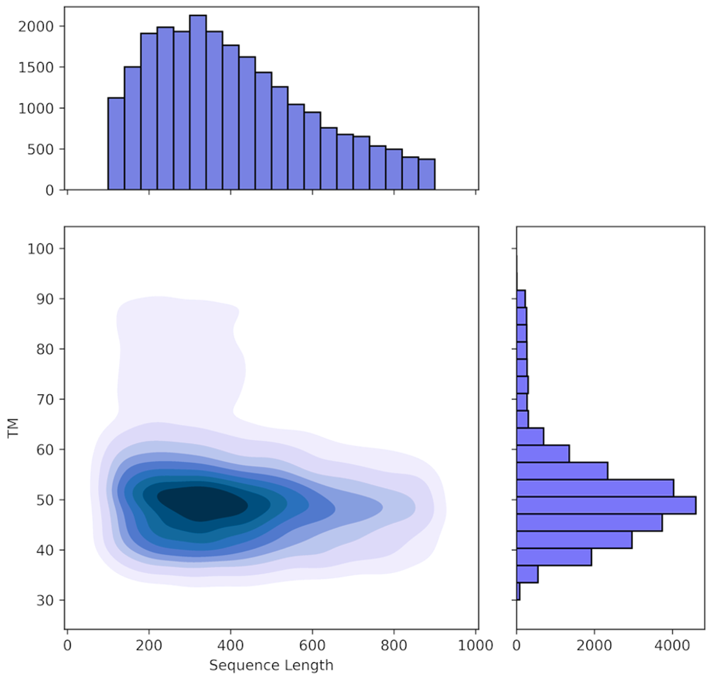
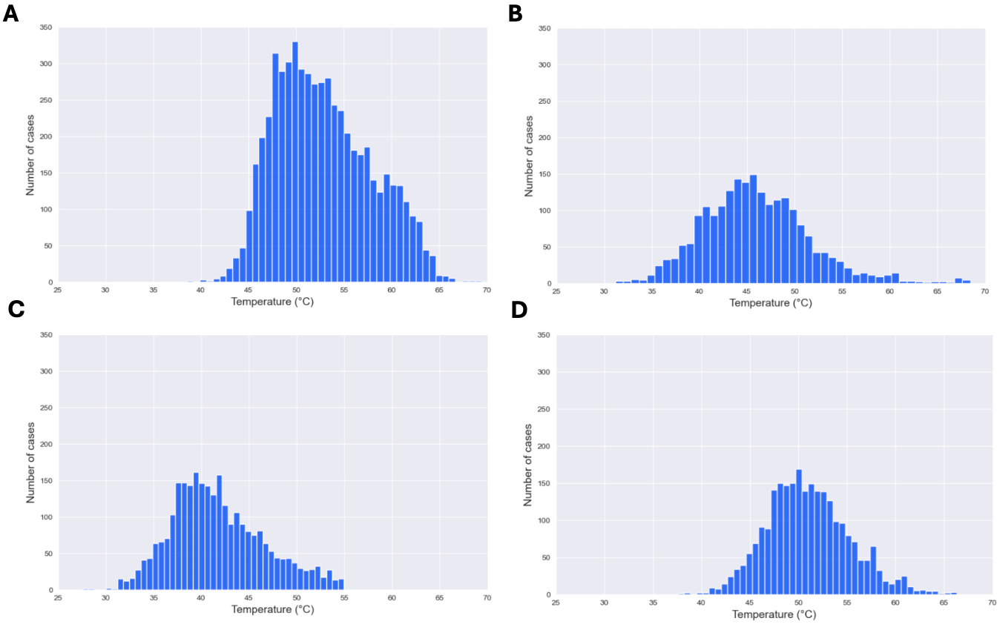
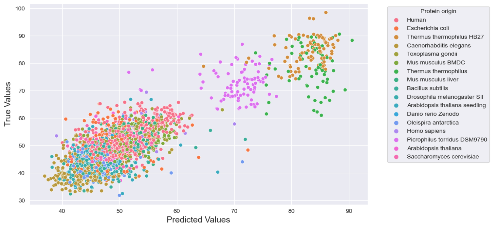

## What is EsmTemp?

EsmTemp is a repository that utilizes the ESM-2 protein model for fine-tuning, with the purpose of enhancing outcomes in the prediction of protein melting temperature (Tm). The repository utilizes the ESM-2 model, accessible [here](https://github.com/facebookresearch/esm), as a basis for fine-tuning processes. The objective is to enhance the accuracy of predictions related to melting temperatures in protein structures. The major goal of this project is to improve the precision of Tm predictions to support biotechnological projects aimed at developing thermostable proteins.

In the context of transfer learning utilizing protein language models (pLM), the extracted embeddings from these latent spaces serve as highly effective features for subsequent tasks. By leveraging the pre-trained knowledge encoded within the embeddings, this approach allows us to fine-tune the model for use in related tasks, in this case predicting the Tm of proteins.


## Data

The dataset was compiled by integrating data from two sources of protein thermostability information: ProThermDB and Meltome Atlas. We utilized data from Tm protein assays performed on cell lysates. The dataset underwent a refinement process that involved the removal of protein sequences with Tm values outside the range of 30°C to 98°C. In order to ensure accurate protein modeling based on the most representative data, sequences that were below 100 or above 900 amino acids in length were excluded. Our approach involved removing duplicate entries and then clustering the remaining sequences using the CD-HIT algorithm to ensure that the training and test sets do not have identical or near identical examples. To minimize redundancy, we set a sequence similarity threshold of 0.7 and a minimum cluster size of 3, while keeping all other parameters at their default values. As a result of this process, we obtained a curated dataset comprising 24,472 distinct amino acid sequences. Each sequence is accompanied by its respective source organism and Tm value.

The distributions of temperature and protein sequence lengths within the dataset are illustrated below.



Moreover, our analysis in the paper delves into the effects of exclusively fine-tuning the model for proteins from specific organisms, specifically focusing on the most frequently occurring ones in the dataset. The figure below provides a visual representation of the Tm distribution for proteins from the four most common organisms' lysates in the curated training set: Human (A), Arabidopsis thaliana seedling (B), Caenorhabditis elegans (C), Mus musculus BMDC (D).



The data are provided in this repo in file dataset.csv

## Results

Our results highlight that the model captures the general trend of Tm for a vast landscape of protein sequence, achieving a coefficient of determination R<sup>2</sup> of 0.70 and a mean absolute error of 4.3°C.

Figures below shows the correlation analysis depicts the relationship between melting temperatures with the prediction for the best fine-tune ESM-2 model across specific organisms.



## How to create conda environment?

```bash
conda create --name esm_env python=3.9
conda activate esm_env
conda install pytorch torchvision torchaudio cudatoolkit=10.2 -c pytorch
conda install pandas
pip install wandb
pip install fair-esm
pip install pyarrow
```

or alternatively, use an environment.yml file:

```bash
conda env create -f environment.yml
conda activate esm_env
```

## How input file should looks like?

The input CSV file is expected to have two columns: 'protein_sequence' containing strings representing amino acid sequences, and 'tm' containing float values indicating temperatures.

## How to run EsmTemp?

To illustrate the usage of EsmTemp, consider the following example command:

```bash
python run_training.py --train_csv_file "data/example_files/train_1.csv" --val_csv_file "data/example_files/val_1.csv" 
```

If you wish to incorporate WandB for experiment tracking, you can add the following option to the command:

```bash
python run_training.py --train_csv_file "data/example_files/train_1.csv" --val_csv_file "data/example_files/val_1.csv" --use_wandb
```

## Generate raw ESM2 embedding

To generate ESM2 embeddings from the 650M model, utilize the generate_raw_embedding.py script as follows:

```bash
python generate_raw_embedding.py --model_size "big" --dataset_path "data/example_files/val_1.csv" --path_embedding_file "val_1_embeddings.csv"
```

Ensure that the CSV input file follows the same format as mentioned above. The path_embedding_file should have a CSV file extension. Subsequently, use this generated file as an input file for training.

## CD-hit filtering for similar sequences

In case you want to use cd-hit, you need to install Biopython:

```bash
conda install -c conda-forge biopython
```

To illustrate the usage of cd-hit, consider the following example command:

```bash
python run_cd_hit.py --input_csv_file "data/example_files/train_1.csv" 
```

Locate the filtered file at: data/data_files/{file_name}_07_n3.csv.

By default, the script employs a sequence similarity threshold of 0.7 and sets the neighboring 'n' value to 3. To adjust these parameters, use the following command:

```bash
python run_cd_hit.py --input_csv_file "data/example_files/train_1.csv" --treshold 0.8 --n 2
```
